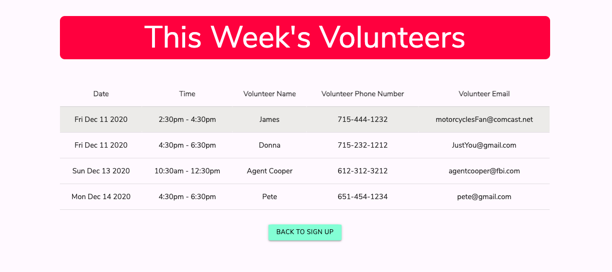

# Sign-up App 
  This summer while volunteering at a lot of foodbanks around the Twin Cities, I noticed that organizers consitently struggled to develop a system to sign people for their shifts. The problem was the form had to be easily accessible while also keeping volunteer information private. Thats why I developed this app. It has an incredibly simple UI, because organizers and volunteers are too busy for all the nonsense. 

## Technology
  * Firebase Realtime Database
  * Firebase Authentication
  * Firebase Hosting
  * jQuery Library
  * jQuery Validation Plugin
  * Materialize UI Framework
  * SCSS
  
  
  ## How it Works
  
  ## As a User
  A User lands on the website and immediately see the available times to volunteer. They then sign up for whichever shift they want. If all their information is entered correctly, they get a notification that they are signed up for the shift.
  
  
  ## As an Admin
  An admin can login at the bottom of the page. From their they can view the volunteer roster for the upcoming week. Once the date for the shift has passed, it is removed from the webpage, but stays in the database. To test out admin view, you can use the following login information:
       Email: admin@admin.com
        Password: adminadmin
    
    
## Credits
  Shoutout to all the wonderful community organizers in Minneapolis.
## Licsense 
  
  

